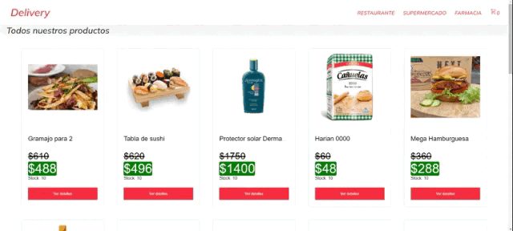

# Delivery

### Descripcion
##### Aplicacion Web basada en REACT
Esta aplicacion fue desarrollada en el transcurso del curso de React Js de CODERHOUSE. El objetivo es desarrollar una SPA (Single Page Application) aprendiendo a programar por componentes, y adquirir los conceptos de manejo de rutas y flujos de datos. 

Se trata del frontend de una tienda online con carrito de compras basado en componentes de React y alojando y consumiendo los datos de productos y ordenes de compra en Firebase.
Actualmente esta aplicacion se encuentra hosteada en Vercel y se puede acceder a ella en el siguiente [link](https://e-comerce-xi.vercel.app/)


### Tecnologias utilizadas
<div style="display: flex">


</div>

* Firebase: Utilizado para alojar los datos de los productos y los datos de las ordenes de comrpa realizadas.


* react-router-dom: Utilizado para el manejo de rutas

* react-toastify: Utilizado para las notificaciones al usuario

* sass: Utilizado para estilos de maquetación.


### Instalacion

##### ¿Como correr esta aplicación localmente?

1. El primer paso es clonar el repositorio. Para esto abrimos una terminal, nos paramos en un directorio adecuado donde se alojará nuestro proyecto localmente y ejecutamos el siguiente comando:
``` 
    :/> git clone https://github.com/pmusetti/eComerce

```

2. Una vez clonado el repositorio se deben instalar las dependencias del proyecto necesarias para su funcionamiento. Para esto debemos acceder a la carpeta del repositorio que acabamos de clonar. Para ejecutamos el siguiente comando:

``` 
    :/> cd eCommerce

    :eCommerce/> npm install

```

3. Una vez instaladas todas las dependencias podemos poner a correr el proyecto con el siguiente comando:

``` 
    :/eCommerce> npm start

```

Listo, con estos simples pasos la aplicacion se abrira automaticamente en nuestro navegador en [http://localhost:3000](http://localhost:3000)

## Demo 
Clic en la imagen para ir a la demo online

[](https://e-comerce-git-master-pmusetti.vercel.app/)


